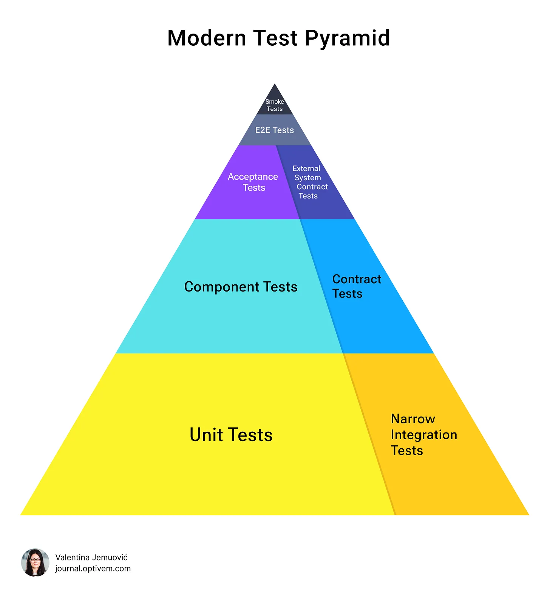
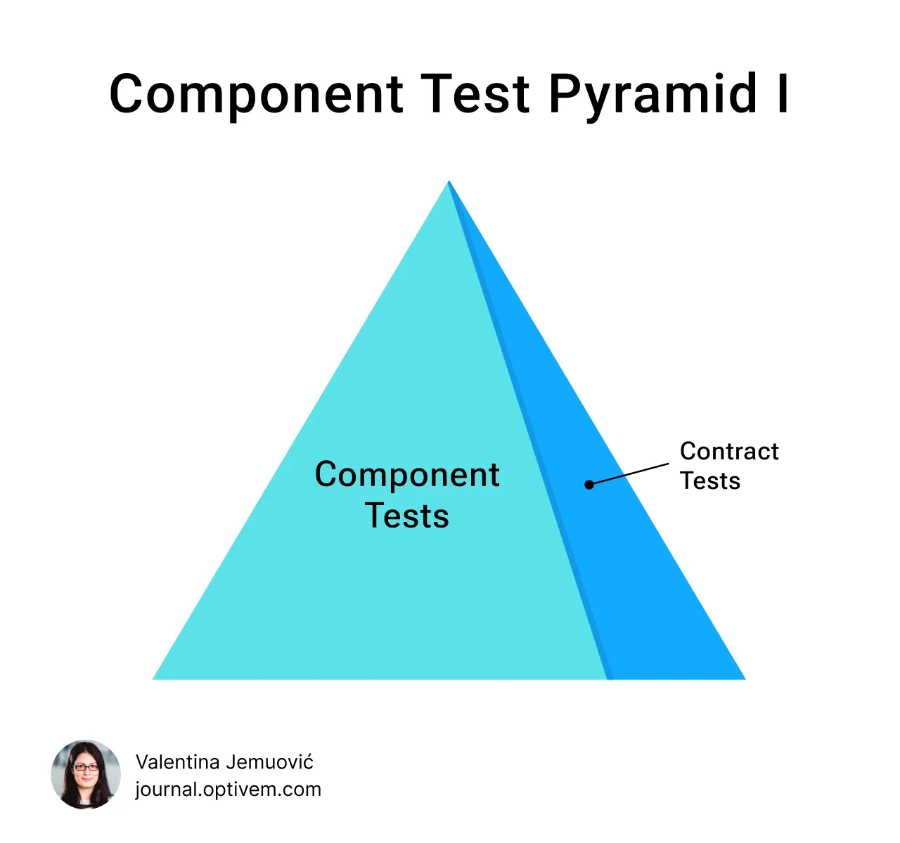
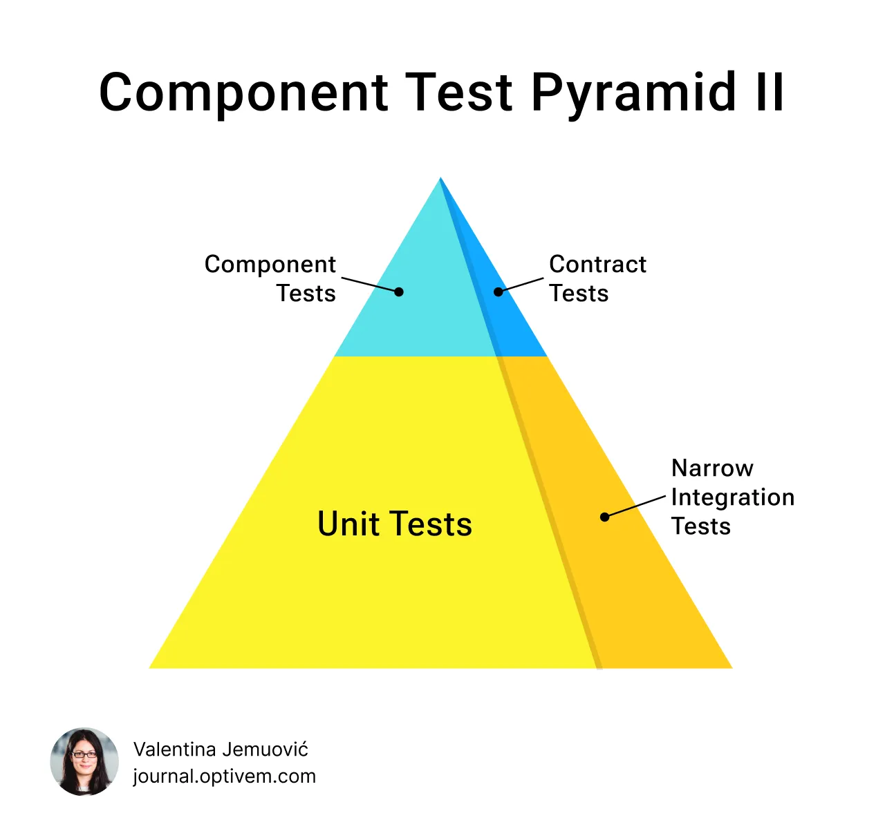

# Valenty

**AI-first compile-time safe acceptance testing for Dart & Flutter.**

Valenty replaces fragile string-based Gherkin with a typed fluent DSL where **the compiler catches errors before you run any test**. The CLI is just an installer -- AI does the heavy lifting: scaffolding builders, writing tests, and maintaining the DSL.

```dart
OrderScenario('should calculate base price as product of unit price and quantity')
    .given
    .product()
        .withUnitPrice(20.00)
    .when
    .placeOrder()
        .withQuantity(5)
    .then
    .shouldSucceed()
    .and
    .order()
        .hasBasePrice(100.00)
    .run();
```

> Try `.given.spaceship()` -- **compile error**.
> Try `.then` before `.when` -- **compile error**.
> The IDE shows you exactly what's available at every step.

---

## The Modern Test Pyramid

Valenty is built on the **Modern Test Pyramid** by [Valentina Jemuovic](https://journal.optivem.com). The old test pyramid (Unit, Integration, E2E) has fundamental problems. The Modern Test Pyramid replaces it with three levels:


*Image credit: [Valentina Jemuovic, Optivem Journal](https://journal.optivem.com/p/modern-test-pyramid-illustrated)*

**Valenty covers the System Level (Acceptance Tests) and the Component Level (Component Tests)** -- the two layers where the highest-ROI bugs live.

> See: [Modern Test Pyramid](https://journal.optivem.com/p/modern-test-pyramid) |
> [Modern Test Pyramid - Illustrated](https://journal.optivem.com/p/modern-test-pyramid-illustrated) |
> [TDD Cycles](https://journal.optivem.com/p/tdd-cycles)

**Valenty fills the gap where production bugs live** -- the System Level (Acceptance Tests) and the Component Level (Component Tests). Unit tests verify that individual components work. E2E tests verify the happy path through the UI. Neither tells you whether the **feature works as the customer expects**.

> _"Your unit tests pass. Your E2E tests pass. And yet, the tax calculation was wrong. [...] There's a massive gap between 'all my unit tests pass' and 'this feature actually works as the customer expects.' That gap is where your production bugs live."_
> -- [Valentina Jemuovic, Optivem Journal](https://journal.optivem.com)

### Why this matters for Flutter teams

Flutter apps typically have many external dependencies (Firebase, Dio, SharedPreferences, SecureStorage, local databases, platform services). These are the boundaries where bugs hide -- and where the old test pyramid fails:

| Old Pyramid Layer | Problem for Flutter |
|---|---|
| **Unit Tests** | Test math, not features. A tax calculation can be correct but use the wrong rate. |
| **Widget Tests** | Test UI rendering, not business behavior. Confirmation page shows up but with wrong total. |
| **Integration Tests** | Slow, fragile, require emulators. Break on CI, skip on PR reviews. |

The Modern Test Pyramid fixes this:

| Modern Pyramid Layer | What it tests | Flutter ROI |
|---|---|---|
| **Acceptance Tests** (Valenty) | Business behavior end-to-end, no UI | Catches feature bugs before QA, runs in seconds |
| **Component Tests** (Valenty) | Frontend in isolation, backend stubbed | Each team gets fast feedback (minutes, not hours) |
| **Contract Tests** | Stubs match real APIs | Prevents integration surprises at deployment |

### Component Test Pyramids

For each component in your system (frontend, backend, microservices), you choose the right level of testing based on its business complexity:

| Low complexity | High complexity |
|---|---|
|  |  |
| Component Tests + Contract Tests | Component Tests + Contract Tests + Unit Tests + Narrow Integration Tests |

*Images credit: [Valentina Jemuovic, Optivem Journal](https://journal.optivem.com/p/modern-test-pyramid-illustrated)*

For a Flutter app with moderate business logic, **Component Test Pyramid I** is often sufficient -- Valenty handles both the Component Tests and the Contract Tests at this level. For complex domains, add Unit Tests and Narrow Integration Tests at the Unit Level.

> See: [How to introduce ATDD in Legacy Code](https://journal.optivem.com/p/how-to-introduce-atdd-in-legacy-code-in-3-months) |
> [Frontend Component Tests](https://journal.optivem.com/p/tdd-in-legacy-code-component-tests-frontend) |
> [Modern TDD - Component Level](https://journal.optivem.com/p/modern-tdd-component-level)

### ROI for Flutter apps

Introducing Valenty acceptance tests in a Flutter project delivers measurable ROI:

- **Fewer production bugs**: Acceptance tests catch the bugs that unit tests miss (wrong inputs, missing integrations, hardcoded values)
- **Faster QA cycles**: QA writes English scenarios, AI translates to typed DSL, tests run in seconds instead of manual testing taking days
- **Safe refactoring**: Rename a builder method in one place, the compiler tells you every test that needs updating -- no silent breakage
- **Team independence**: With component tests, the frontend team gets feedback in minutes without waiting for the backend team
- **Legacy code safety net**: Write tests AFTER code (Test Last), capture current behavior, then refactor with confidence

> _"ATDD is the foundation. When you have that, you're ready for any other improvements. You'll be able to safely upgrade your Tech Stack, redesign your Architecture, introduce Unit Tests & clean up your Code."_
> -- [Valentina Jemuovic](https://journal.optivem.com/p/how-to-introduce-atdd-in-legacy-code-in-3-months)

### Gherkin vs Valenty

| | Textual Gherkin | Valenty DSL |
|---|---|---|
| **Typo in step** | Runtime failure | Compile error |
| **IDE support** | None | Full autocompletion |
| **Refactor domain** | Find/replace strings everywhere | Rename once, done |
| **Step ordering** | Nothing prevents 2 Whens | Compiler enforces Given->When->Then |
| **AI generation** | AI can invent nonexistent steps | AI can only use existing builder methods |
| **Maintenance at scale** | Painful (string duplication) | Trivial (type-safe refactoring) |

### Why Valenty?

The workflow is simple:

```
QA writes scenario in English
    --> AI translates to typed DSL
        --> Compiler validates structure
            --> Tests run
```

---

## Quick Start

```bash
# 1. Install the CLI
dart pub global activate valenty_cli

# 2. Initialize in your project (adds dependency + AI skills)
cd my_project
valenty init

# 3. Ask your AI to scaffold builders
#    "Scaffold the Order feature builders for acceptance testing"

# 4. Ask your AI to write tests
#    "Write test for: Given a product with unit price $20, when order placed with quantity 5, then base price is $100"

# 5. Run tests
dart test
```

That is it. The CLI installs everything. Your AI tool reads the generated skill files and knows the full DSL architecture, your project's models, and how to generate correct typed code.

---

## Complete AI Setup Guide

Valenty is designed so that AI tools do the actual work. The `valenty init` command detects which AI tools you use and generates instruction files that teach each tool:

1. The complete typed builder architecture (phantom types, builder hierarchy)
2. Code templates for every builder type (Scenario, Given, When, Then, Assertion)
3. Working examples of correct DSL code
4. A snapshot of your project (domain models, existing builders, features)

### Claude Code

```bash
valenty init  # Auto-detects .claude/ directory
```

Generated file: `.claude/skills/valenty-test-writer/SKILL.md`

This skill file gives Claude Code complete knowledge of how to scaffold builders from your domain models and write acceptance tests using the typed DSL. It includes the full builder hierarchy, phantom type constraints, code templates, and a live snapshot of your project's current state (models, features, existing builders).

### Cursor

```bash
valenty init  # Auto-detects .cursor/ directory
```

Generated file: `.cursor/rules/valenty.mdc`

The rule file is loaded automatically by Cursor and provides the same complete DSL knowledge as the Claude skill.

### Codex

```bash
valenty init  # Always generates AGENTS.md
```

Generated file: `AGENTS.md`

This file is always generated regardless of which AI tools are detected, since it serves as a portable instruction format.

### OpenCode

```bash
valenty init  # Auto-detects .opencode/ directory
```

Generated file: `.opencode/agents/valenty-test-writer.md`

### Refreshing AI Context

After you add new builders, new features, or update Valenty itself, regenerate the skill files so your AI tool sees the latest project state:

```bash
valenty generate skills
```

This re-introspects your project (scans `test/valenty/features/` for builders and `lib/` for domain models) and updates all detected AI tool files with the current snapshot.

---

## The AI Workflow

```
PHASE 1: Setup
  valenty init
      |-- Adds valenty_dsl as dev dependency
      |-- Creates .valenty.yaml configuration
      |-- Generates AI skill files for detected tools

PHASE 2: Scaffold (AI does this)
  Tell your AI: "Scaffold the Payment feature"
      |-- AI reads your domain models in lib/
      |-- AI generates the full builder tree:
          Scenario, GivenBuilder, DomainObjectBuilders,
          WhenBuilder, ActionBuilder, ThenBuilder, AssertionBuilders

PHASE 3: Refresh context
  valenty generate skills
      |-- Updates AI skill files with new builders
      |-- AI now knows about the new feature

PHASE 4: Write tests (AI does this)
  Tell your AI: "Write test: Given a payment of $50..."
      |-- AI reads existing builders
      |-- AI generates typed DSL code using only real methods
      |-- Compiler validates the result

PHASE 5: Iterate
  Rename builders or methods in one place
      |-- Compiler catches all broken tests
      |-- Fix in one place, all tests update
```

### Adding a New Domain Concept

When you need a new concept (e.g., "shipping address"):

1. Ask your AI: "Add an AddressGivenBuilder to the Order feature"
2. The AI reads existing builders and creates the new one following the pattern
3. Regenerate AI skills:

```bash
valenty generate skills
```

4. Now you (or AI) can write:

```dart
OrderScenario('should use shipping address')
    .given
    .product().withUnitPrice(20.00)
    .and
    .address()
        .withCity('New York')
        .withZipCode('10001')
    .when
    .placeOrder().withQuantity(1)
    .then
    .shouldSucceed()
    .run();
```

### Adding a New Feature

Ask your AI: "Scaffold the Payment feature builders for acceptance testing"

The AI reads your `lib/` code, finds the Payment domain models, and generates the complete builder tree. Then run `valenty generate skills` so the AI knows about the new feature for future test writing.

---

## CLI Commands

| Command | What it does |
|---------|-------------|
| `valenty init` | Full setup: add DSL dependency, create config, install AI skills |
| `valenty generate skills` | (Re)generate AI skill files after updating builders or Valenty |
| `valenty scaffold feature <name> --models <paths>` | Generate builder tree from model files |
| `valenty list features` | List all scaffolded features and their builders |
| `valenty list builders [--feature X] [--phase given]` | List builders with filtering by feature or phase |
| `valenty context [--format json\|yaml]` | Output full project state for AI consumption |
| `valenty validate [--feature X]` | Validate builder files for correctness and conventions |
| `valenty test [--feature X] [--scenario "name"]` | Run Valenty acceptance tests (wraps dart/flutter test) |
| `valenty doctor` | Check environment readiness |
| `valenty update` | Self-update the CLI |

### Command Details

**`valenty scaffold feature`** -- Reads Dart model files and generates the full builder tree for a feature. Accepts comma-separated model paths:

```bash
valenty scaffold feature order --models lib/models/order.dart,lib/models/product.dart
```

**`valenty list builders`** -- Introspects the project and lists every builder with its methods and return types. Filter by feature or phase:

```bash
valenty list builders --feature order --phase given
```

**`valenty context`** -- Outputs structured YAML or JSON describing every feature, builder, and method. Useful for piping into AI tools or debugging:

```bash
valenty context --format json
```

**`valenty validate`** -- Checks builder files for structural correctness (missing scenario class, orphaned builders, naming convention violations):

```bash
valenty validate --feature order
```

**`valenty test`** -- Wraps `dart test` or `flutter test` with Valenty-specific targeting. Supports feature filtering, scenario name patterns, reporter selection, and coverage:

```bash
valenty test --feature order --scenario "base price" --reporter expanded
valenty test --coverage
```

---

## DSL Builder Hierarchy

The type system enforces the Given -> When -> Then flow at compile time using phantom types:

```
FeatureScenario
    |
    v
.given --> GivenBuilder --> DomainObjectBuilder<NeedsWhen>
                                |
                                | .withField(), .and
                                |
                                v
           .when  --> WhenBuilder --> ActionBuilder<NeedsThen>
                                          |
                                          | .withParam()
                                          |
                                          v
                      .then --> ThenBuilder --> AssertionBuilder
                                                    |
                                                    | .hasField(), .shouldSucceed()
                                                    |
                                                    v
                                              .run() --> ScenarioRunner
```

Each arrow represents a type transition. You cannot call `.when` from a `ThenBuilder` or `.then` from a `GivenBuilder` -- the compiler rejects it. The phantom type parameters (`NeedsWhen`, `NeedsThen`) encode the state machine into the type system.

### Builder File Structure

When AI scaffolds a feature, it generates this structure:

```
test/valenty/features/<feature>/
+-- <feature>_scenario.dart              # Entry point: FeatureScenario('...')
+-- builders/
|   +-- given/
|   |   +-- <feature>_given_builder.dart # .given.product(), .given.coupon()
|   |   +-- product_given_builder.dart   # .withUnitPrice(), .withName()
|   |   +-- coupon_given_builder.dart    # .withDiscount(), .withCode()
|   +-- when/
|   |   +-- <feature>_when_builder.dart  # .when.placeOrder()
|   |   +-- place_order_when_builder.dart # .withQuantity()
|   +-- then/
|       +-- <feature>_then_builder.dart   # .then.shouldSucceed(), .then.order()
|       +-- order_assertion_builder.dart  # .hasBasePrice(), .hasQuantity()
+-- scenarios/
    +-- (test files go here)
```

---

## Architecture

```
valenty_dsl (library -- add as dev_dependency)
    +-- Core: phantom types, ScenarioBuilder, TestContext
    +-- Builders: GivenBuilder, WhenBuilder, ThenBuilder,
    |            DomainObjectBuilder, AssertionBuilder
    +-- Runner: ScenarioRunner (executes scenarios as package:test tests)
    +-- Channels: UI, API, CLI (for multi-channel testing)
    +-- Fixtures: FixtureBase, TestDataBuilder, CreationMethods
    +-- Matchers: hasField, satisfiesAll, expectDelta
    +-- Helpers: parameterizedTest, guardAssertion

valenty_cli (CLI tool -- install globally)
    +-- init: project setup + AI skill generation
    +-- generate: AI tool skill files
    +-- scaffold: builder tree generation from models
    +-- list: feature and builder introspection
    +-- context: structured project state output
    +-- validate: builder correctness checking
    +-- test: acceptance test runner
    +-- doctor: environment check
    +-- update: self-update
```

---

## Examples

Each example demonstrates a different level of the Modern Test Pyramid and architecture style:

| Example | Pyramid Level | Architecture | External Dependencies |
|---------|--------------|-------------|----------------------|
| [`order_pricing`](examples/order_pricing/) | System (Acceptance) | Simple models + builders | None |
| [`auth_flow`](examples/auth_flow/) | Component | Hexagonal (ports + adapters + fakes) | Dio, SecureStorage, SharedPrefs |
| [`ecommerce`](examples/ecommerce/) | Component | Hexagonal (ports + adapters + fakes) | Firebase, HTTP, Notifications, SharedPrefs |
| [`clean_arch_weather`](examples/clean_arch_weather/) | Component | Clean Architecture (domain/data/presentation) | HTTP API, local cache |

### System Level: Acceptance Tests (order_pricing)

Pure business behavior testing -- no external dependencies, no UI:

```bash
cd examples/order_pricing && dart test
```

### Component Level: Testing with External Dependencies (auth_flow, ecommerce)

Test the frontend/backend in isolation using the **port/fake pattern**
([Hexagonal Architecture](https://journal.optivem.com/p/hexagonal-architecture-ports-and-adapters)):

```
lib/ports/       # Driven Port interfaces (abstract classes)
lib/adapters/    # Real implementations (Dio, Firebase, SharedPrefs)
test/.../fakes/  # Test doubles (same interface, in-memory)
```

> See: [Frontend Component Tests](https://journal.optivem.com/p/tdd-in-legacy-code-component-tests-frontend) |
> [Hexagonal Architecture](https://journal.optivem.com/p/hexagonal-architecture-ports-and-adapters)

```bash
cd examples/auth_flow && dart test
cd examples/ecommerce && dart test
```

### Component Level: Clean Architecture (clean_arch_weather)

Flutter-style Clean Architecture with entity/model separation, use cases, and cache-fallback
logic tested through the real repository with fake datasources:

```
lib/features/weather/domain/    # Entities, repository interface, use cases
lib/features/weather/data/      # Models (fromJson), datasources, repository impl
test/.../fakes/                 # Fake datasources (not fake repository)
```

The real `WeatherRepositoryImpl` is tested -- fakes replace the datasources, not the business
logic. This validates the actual cache-fallback behavior
([Clean Architecture Data Flow](https://journal.optivem.com/p/clean-architecture-on-the-backend-data-flow)).

```bash
cd examples/clean_arch_weather && dart test
```

---

## Packages

| Package | Description | Status |
|---------|-------------|--------|
| `valenty_cli` | CLI tool -- installs DSL dependency and AI skills | 0.1.0 - Pre-release |
| `valenty_dsl` | DSL library -- phantom types, builders, matchers | 0.1.0 - Pre-release |

---

## License

MIT
